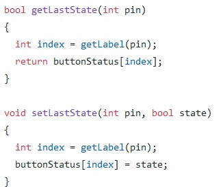

# Progetto 3 | Diario di lavoro
##### B. Beffa, F. FInke, M. Ghilardini
### Trevano, 2019-03-13
---
## Lavori svolti
- Abbiamo:
    - Preparato il cavo per collegare l'Arduino principale con quello che gestisce i 2 display;
    - Risolto il problema relativo all'anti-rimbalzo dei pulsanti;
    - Rilevati i pin da utilizzare per il Buzzer;
    - Implementato programma 6;
    - Risolti vari problemi in altri programmi;

---

## Problemi riscontrati e soluzioni adottate 
| Problema              | Soluzione adottata    | 
|-----------------------|-----------------------|
|Anti-rimbalzo| 

---

##  Punto della situazione rispetto alla pianificazione
In ritardo: non avevamo preso in considerazione la pausa dovuta alle vacanze scolastiche.

---

## Programma di massima per la prossima giornata di lavoro
- Completare programmi fino all'11 e cominciare il 12;
- Fissare il display 7 segmenti sul telaio;
- Riflettere sull'implementazione del display LCD;